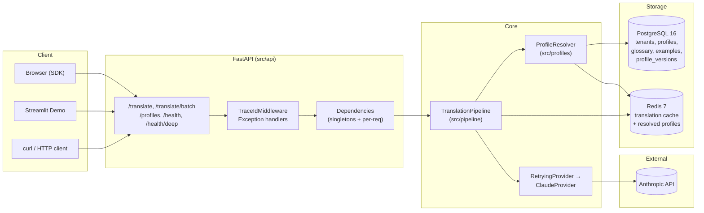
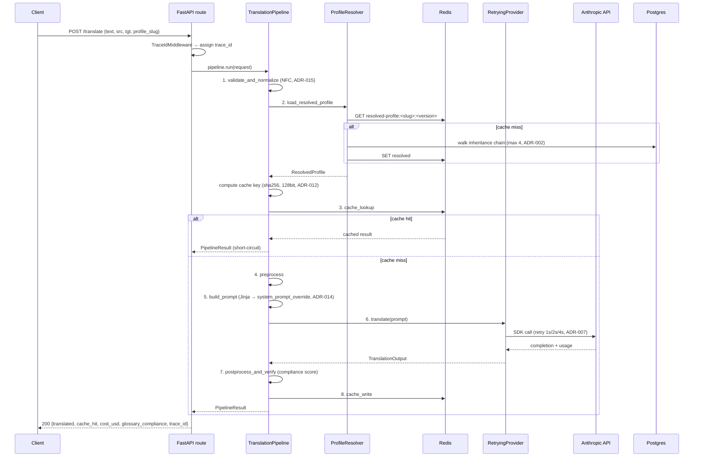

# Dokumentasi Teknis — AI Translation API

> **Versi**: Draft awal — 2026-05-20
> **Sumber fakta**: `CLAUDE.md` di repo (commit `f65575f`). Hal-hal yang butuh detail dari source code ditandai `[CLARIFY: ...]` dan diringkas di bagian akhir.
> **Status MVP**: Phase 1–7 selesai.
> **Konvensi label**: **FAKTA** = dinyatakan eksplisit di CLAUDE.md. **REKOMENDASI** = saran penulis dokumen, bukan keputusan tim.

---

## 1. Ringkasan Eksekutif Teknis

**AI Translation API** adalah backend Python yang menyediakan dua produk:

1. **Domain-aware translation per profile** — setiap departemen/produk punya glossary, tone, dan style examples sendiri yang dapat dikonfigurasi dinamis tanpa redeploy.
2. **Live webpage translation via JavaScript SDK** — drop-in `<script>` yang men-translate konten halaman secara progresif dengan memanggil REST API.

Arsitektur stateless (semua state hidup di Postgres atau Redis) dengan provider abstraction yang membatasi dependency Anthropic SDK ke satu file (ADR-001), agar provider lain bisa di-swap tanpa menyentuh business logic.

**Tech stack (FAKTA):**

- **Bahasa & runtime**: Python 3.11+, async-native (`asyncio`)
- **Web framework**: FastAPI
- **Database**: PostgreSQL 16 + SQLAlchemy 2.0 (async) + Alembic
- **Cache**: Redis 7
- **LLM provider**: Anthropic SDK (model default `claude-sonnet-4-6`)
- **Schema validation**: Pydantic v2
- **Prompt templating**: Jinja2
- **Logging**: `structlog` (JSON output)
- **Testing**: `pytest` + `pytest-asyncio` (`asyncio_mode=auto`)
- **Tooling**: `uv` (deps), `ruff` (lint), `mypy --strict` (typing), pre-commit
- **Demo UI**: Streamlit (`:8501`) + static webpage (`:8001`)

**Status MVP per `f65575f`:**

| Phase | Cakupan | Verified |
|---|---|---|
| 1 | Foundation, tooling, docker-compose, `/health` | 2026-05-20 |
| 2 | LLM Provider Abstraction Layer | 2026-05-20 |
| 3 | Profile System (model, repo, resolver, glossary) | 2026-05-20 |
| 4 | Translation Pipeline + Redis Cache | 2026-05-20 |
| 5 | REST API + Streamlit demo UI | 2026-05-20 |
| 6 | Basic evaluation harness | 2026-05-20 |
| 7 | Live Webpage Translation SDK | 2026-05-20 |

---

## 2. Arsitektur Sistem

### 2.1 Komponen High-Level



### 2.2 Sequence: `POST /translate` end-to-end



### 2.3 Layer di `src/`

| Folder | Tanggung jawab | Catatan |
|---|---|---|
| `src/api/` | FastAPI routes, middleware, dependency factories, boundary schemas | Singleton (cache/provider/template env) via `@lru_cache`; per-request (resolver/pipeline/repo) — ADR-016 |
| `src/pipeline/` | Orchestrator 8-stage + Jinja templates + compliance scoring | Tiap stage testable independen |
| `src/providers/` | Provider abstraction (`Protocol`), Claude impl, retry wrapper, pricing table | Anthropic SDK **hanya** di `claude.py` — ADR-001 |
| `src/profiles/` | Domain model, repository CRUD, inheritance resolver, glossary selector | `ResolvedProfile` adalah materialized view runtime |
| `src/cache/` | `CacheBackend` Protocol, Redis impl | Semua `RedisError` ditelan — ADR-013 |
| `src/db/` | SQLAlchemy models, session/engine setup | UUID PK via `gen_random_uuid()` (Postgres 16 built-in) |
| `src/config/` | Settings (env-driven), logging setup | Tidak ada magic number di kode lain |

> `[CLARIFY: CLAUDE.md menyebut layer "eval" di "src/" pada bagian "Arsitektur tingkat tinggi", tapi runner Phase 6 (golden_v1.jsonl, run.py, dll) hidup di "eval/" (root). Perlu cek apakah keduanya ada atau hanya salah satu.]`

---

## 3. Konsep Inti (Glosarium)

| Term | Definisi |
|---|---|
| **Profile** | Konfigurasi domain berupa baris di tabel `profiles` (slug, name, domain, tone, target_audience, parent_id, version). Multi-tenant ready meski sekarang single tenant. Soft-deleted dengan flip `is_active=False` + bump version (ADR-017). |
| **Glossary Term** | Aturan terjemahan eksak per profile: `source_term` → `target_term` untuk pasangan bahasa tertentu, dengan `context` (untuk disambiguation), `is_forbidden` flag, dan `priority`. |
| **Style Example** | Pasangan source/target text untuk few-shot prompting, dikategorikan via `tags` dan lang pair. |
| **Inheritance Chain** | Rantai profile via `parent_id`, maksimum 4 level (ADR-002). Child override scalar fields, glossary merge child-wins-on-conflict, examples additive. |
| **Resolved Profile** | Snapshot runtime hasil walk inheritance chain. Setiap glossary/example carry `origin_profile_slug` (audit). Bukan persisted entity. `resolution_chain` ordered leaf → root. |
| **Cache Key Composition** | `sha256(text ⨁ src_lang ⨁ tgt_lang ⨁ profile_slug ⨁ profile_version ⨁ model_id)` di-truncate ke 128 bit hex, joined dengan ASCII unit separator `\x1f` (ADR-003 + ADR-012). |
| **Compliance Score** | `1.0 - (violations / checks)` jika ada term applicable; `1.0` kalau tidak ada. Case-insensitive substring match. Signal-only — pipeline tidak refuse output (ADR-021). |
| **Trace ID** | UUID yang di-assign per request oleh `TraceIdMiddleware`, di-propagate ke structured log dan error envelope (ADR-019). |
| **Quality Mode** | Field di `profiles` untuk pilih trade-off speed/cost/quality. Disimpan sebagai `String` + `CHECK` constraint (bukan Postgres ENUM, ADR-009). `[CLARIFY: nilai-nilai exact tidak terdaftar di CLAUDE.md — kemungkinan "fast"/"balanced"/"premium", perlu cek migration]`. |
| **Tenant** | Unit isolasi top-level. MVP cuma punya `internal-company`. `tenant_id` wajib di semua tabel meski single-tenant — disiapkan untuk multi-tenant masa depan. |

---

## 4. Data Model

### 4.1 Skema Tabel

Lima tabel utama dari migration `alembic/versions/001_profile_schema.py` (FAKTA), kolom kunci di bawah. Detail tipe & constraint exact ditandai `[CLARIFY]`.

**`tenants`**
- `id UUID PK DEFAULT gen_random_uuid()`
- `[CLARIFY: kolom lain — slug, name, created_at? CLAUDE.md hanya menyebut keberadaan tabel]`

**`profiles`** (self-referential)
- `id UUID PK`
- `tenant_id UUID FK → tenants.id` (wajib — multi-tenant ready)
- `parent_id UUID FK → profiles.id NULLABLE` (inheritance)
- `slug VARCHAR` (unique per tenant — `[CLARIFY: unique constraint exact]`)
- `name`, `domain`, `tone`, `target_audience`
- `quality_mode VARCHAR` + `CHECK` constraint (bukan ENUM, ADR-009)
- `version INTEGER` (bumped on update + soft delete)
- `is_active BOOLEAN` (soft delete flag, ADR-017)

**`glossary_terms`**
- `id UUID PK`
- `profile_id UUID FK → profiles.id`
- `source_term`, `source_lang`, `target_term`, `target_lang`
- `context` (disambiguation)
- `is_forbidden BOOLEAN`
- `priority INTEGER`
- `[CLARIFY: indexes untuk substring ranking?]`

**`style_examples`**
- `id UUID PK`
- `profile_id UUID FK`
- `source_text`, `target_text`, `source_lang`, `target_lang`
- `tags` (`[CLARIFY: array column? JSONB?]`)

**`profile_versions`** (audit snapshot)
- `id UUID PK`
- `profile_id UUID FK`
- `version INTEGER`
- `snapshot JSONB` — loose `dict[str, Any]` agar audit log lama tetap readable saat schema berubah (ADR-011)
- `[CLARIFY: created_at, created_by?]`

### 4.2 Tiga Representasi Profile

Konsep "profile" muncul dalam tiga model object berbeda. Kapan pakai yang mana:

| Representasi | Lokasi | Kapan pakai |
|---|---|---|
| **SQLAlchemy `Profile`** | `src/db/models.py` | ORM row, source of truth Postgres. Dipakai di repository layer (`src/profiles/repository.py`). Async query, eager-load relations. |
| **Pydantic `ProfileCreate` / `ProfileRead` / `ProfileUpdate`** | `src/profiles/schemas.py` | Boundary API. `Create` (POST), `Read` (response), `Update` (PATCH — semantics via `model_fields_set`). Validate request & serialize response. |
| **`ResolvedProfile`** | `src/profiles/schemas.py` | Materialized view runtime — hasil walk inheritance chain. Bawa `resolved_glossary`, `resolved_examples`, `resolution_chain`. Di-pass ke pipeline. **Tidak persisted.** |

**Aturan praktis:** Repository return ORM model → di-map ke `ProfileRead` di boundary route. Resolver return `ResolvedProfile`. Jangan campur lapisan.

---

## 5. Translation Pipeline (Deep Dive)

### 5.1 Delapan Stage

Pipeline di-orchestrate oleh `TranslationPipeline` (`src/pipeline/pipeline.py`). State di-thread via `PipelineContext` dataclass. Tiap stage log satu structured event dan dapat di-test independen.

| # | Stage | Input | Output | Side effect |
|---|---|---|---|---|
| 1 | `validate_and_normalize` | `PipelineRequest` mentah | Text ter-normalize (NFC, ADR-015) | — |
| 2 | `load_resolved_profile` | `profile_slug`, `tenant_id` | `ResolvedProfile` | Read Postgres + Redis cache lookup/write |
| 3 | `cache_lookup` | Cache key | `PipelineResult` atau `None` | Redis `GET` |
| 4 | `preprocess` | Text + profile | Preprocessed text | `[CLARIFY: apa yang sebenarnya dikerjakan stage ini — token cleanup? markup escape? CLAUDE.md tidak detail]` |
| 5 | `build_prompt` | Text + profile + glossary subset + examples | Rendered Jinja template (string) | — |
| 6 | `translate` | Prompt + user message | `TranslationOutput` (text + usage) | Call Anthropic API via `RetryingProvider` (retry 1s/2s/4s, ADR-007) |
| 7 | `postprocess_and_verify` | Provider output | Final text + `glossary_compliance` score | — |
| 8 | `cache_write` | Final `PipelineResult` | — | Redis `SET` (tidak fatal kalau gagal, ADR-013) |

**Short-circuit**: kalau Stage 3 hit, pipeline langsung return `PipelineResult` dengan `cache_hit=True`. Stage 4–8 di-skip. Smoke test mencatat replay 0.7 ms vs first-call 1.5 detik (~2215× speedup).

> **REKOMENDASI**: Untuk dokumentasi internal yang akurat, baca `src/pipeline/stages.py` untuk type signature exact tiap stage function. Deskripsi I/O di atas masih partial (terutama Stage 4 `preprocess`).

### 5.2 Cache Key Formula

```python
parts = [text, source_lang, target_lang, profile_slug, str(profile_version), model_id]
joined = "\x1f".join(parts)                  # ASCII unit separator
digest = sha256(joined.encode("utf-8")).hexdigest()
cache_key = digest[:32]                       # 32 hex chars = 128 bit
```

**Kenapa truncate ke 128 bit** (ADR-012): cukup unique untuk lifetime cache (collision probability functionally zero) tapi menghemat separuh storage Redis dibanding 64-char SHA-256 penuh.

**Kenapa pakai `\x1f`, bukan koma/colon** (ADR-012): mencegah concatenation collision. Tanpa separator, `("ab", "c")` dan `("a", "bc")` menghasilkan input hash yang sama. ASCII unit separator tidak akan muncul di payload teks normal.

**Kenapa include `profile_version`** (ADR-003): bumping version saat update profile otomatis invalidate cache lama tanpa perlu manual flush. Cache row lama natural fall-off via TTL.

### 5.3 Anatomi Prompt Template

Template: `src/pipeline/templates/translate.jinja`. Section yang dibangun (FAKTA, urutan):

- **`<role>`** — tone + `target_audience` + domain dari profile
- **`<style_guide>`** — `[CLARIFY: konten exact section ini — apakah dari profile field atau hardcoded? CLAUDE.md sebut namanya, bukan isinya]`
- **`<glossary>`** — di-split menjadi:
  - **required** terms (`is_forbidden=False`) — yang harus dipakai
  - **forbidden** terms (`is_forbidden=True`) — yang tidak boleh muncul
- **`<examples>`** — few-shot pairs dari `style_examples`, lang-pair matched
- **`<task>`** — instruksi translate + source/target lang

Template di-render full lalu di-pass sebagai `system_prompt_override` ke provider (ADR-014). User message tetap simple (`"Translate from X to Y... Text: ..."`). Text muncul dua kali (system + user), redundansi minor yang diterima untuk **tidak modifikasi contract `ClaudeProvider`** dari Phase 2.

### 5.4 Compliance Scoring

**Rumus** (`src/pipeline/compliance.py`):

```
score = 1.0 - (violations / checks)   jika checks > 0
score = 1.0                            jika checks == 0  (vacuous truth)
```

**Mode pengecekan:**
- **Case-insensitive substring match** terhadap output text
- **Required** terms: violation kalau term tidak muncul
- **Forbidden** terms: violation kalau term muncul
- Return tuple `(score, violations)`; `violations` adalah daftar term yang melanggar

**Behavior:** signal-only. Score di-attach ke response (`glossary_compliance`), tapi pipeline **tidak refuse** output. Konsumer (UI / SDK / client) yang memutuskan apa yang dilakukan dengan score rendah. Fungsi yang sama di-reuse apa adanya oleh eval harness (ADR-021) supaya score di prod dan di eval tidak pernah drift.

---

## 6. Profile System (Deep Dive)

### 6.1 Inheritance Walk Algorithm

(`src/profiles/resolver.py`)

1. Mulai dari profile target (leaf).
2. Walk via `parent_id` ke arah root.
3. **Cycle detection**: track set `profile.id` yang sudah visited; raise jika repeat.
4. **Max depth**: `MAX_INHERITANCE_DEPTH = 4` (ADR-002). Raise jika exceeded.
5. Build `resolution_chain` ordered **leaf → root** (audit-friendly).

**Merge rules:**

| Field | Strategy |
|---|---|
| Scalar (`tone`, `target_audience`, `quality_mode`) | Child wins (closest to leaf) |
| `resolved_glossary` | Merge by key `(lower(source_term), source_lang, target_lang)`; **child wins on conflict** |
| `resolved_examples` | **Additive**, deduped by exact identity |

Setiap entry resolved punya `origin_profile_slug` supaya saat debug bisa lihat dari profile mana term/example datang.

### 6.2 Glossary Selection per Request

(`src/profiles/glossary.py`)

Dari `resolved_glossary` yang bisa puluhan term, pipeline hanya butuh subset yang relevan dengan teks sumber:

1. **Exact substring match** terhadap source text (case-insensitive).
2. Sort hasil: `priority DESC`, lalu `len(source_term) DESC` (longer term = more specific match).
3. Truncate ke `max_terms` (default 20).

> **REKOMENDASI** (komentar TODO di kode per CLAUDE.md): Phase 2 of glossary akan menambah lemma matching + vector similarity untuk handle synonym/inflection (ADR-005). Sementara exact-substring sudah cukup untuk MVP.

### 6.3 Resolver Caching di Redis

Resolved profile di-cache di Redis supaya inheritance walk tidak diulang per request.

- **Key format**: `[CLARIFY: format key exact — kemungkinan resolved-profile:<tenant_id>:<slug>:<version> atau variannya. CLAUDE.md menyebut "cache resolved profile di Redis" tanpa detail]`
- **Auto-invalidation**: bump `version` saat update / soft-delete → cache row lama natural fall-off via TTL
- **TTL**: `[CLARIFY: tidak disebut di CLAUDE.md]`

### 6.4 Versioning + Soft Delete

- `update_profile` di repository: **WRITE snapshot ke `profile_versions` SEBELUM mutate**, lalu bump `version`. PATCH semantics via `model_fields_set` — cuma update field yang explicit di-set di request body.
- `delete_profile` adalah **soft delete** (ADR-017): flip `is_active=False` + bump version. Kenapa bukan hard delete:
  - Cache entries dengan version lama natural fall-off via TTL.
  - Future audit/rollback masih bisa baca row.
  - Hard delete bakal orphan glossary + examples FK-cascade-style.

---

## 7. SDK Webpage Translation (Deep Dive)

### 7.1 Kenapa TreeWalker, Bukan innerHTML Rewrite (ADR-024)

innerHTML rewrite akan flatten inline markup di tengah paragraf (`<a>`, `<strong>`, dll). TreeWalker yields **raw text nodes** + translatable attributes; kita replace `nodeValue` in-place. Posisi markup terjaga.

**Trade-off:** kalau translation perlu reorder markup (mis. bahasa SOV vs SVO yang butuh swap posisi `<a>`), kita tidak bisa handle. Diterima untuk MVP.

### 7.2 Apa yang Di-Walk

- **Text nodes** (kecuali kena skip rule)
- **Translatable attributes**: `alt`, `title`, `placeholder`, `<meta name=description>`, `og:title`, `og:description`

**Skip rules:**

| Mekanisme | Detail |
|---|---|
| `SKIP_TAGS` | `{SCRIPT, STYLE, CODE, PRE, KBD, SAMP, TEXTAREA, NOSCRIPT}` |
| Atribut HTML standar | `[data-no-translate]`, `[translate="no"]` |
| Idempotency tag | `[data-translated]` (sudah pernah di-translate) |

### 7.3 Batch Bin-Packing

Greedy bin-packing dengan dua batasan:

- `MAX_BATCH_ITEMS = 50`
- `MAX_BATCH_CHARS = 4000`
- **Block boundary preference**: ketika batch mendekati char limit, prefer break di boundary block (paragraf, list item) supaya konteks tidak terpotong. Block ditandai via `_blockKey(node)` → `data-tr-block` attribute.
- **Visibility ordering**: `sortByVisibility` skor batch dari `getBoundingClientRect` — viewport-visible duluan supaya user cepat lihat translation di area yang sedang di-scroll.

### 7.4 Client Cache (2-Tier, ADR-025)

| Tier | Storage | Fail behavior |
|---|---|---|
| 1 | In-memory LRU (`ClientCache`) | — |
| 2 | `localStorage` | Silent fallthrough (quota exceeded, private mode) |

**Key construction:**
- djb2 hash dari text + lang pair
- **Profile version di-fold** ke key — fetched lazily di first translate via `GET /profiles/{slug}`
- Server bump version → otomatis invalidate client cache di next page load

### 7.5 MutationObserver

- Watch DOM subtree untuk node baru (mis. SPA route change, modal pop)
- **Debounce 250 ms** — batch perubahan beruntun
- **Filter**: skip attribute-only mutations dan mutations yang cuma menambah tag `[data-translated]` (kita sendiri yang nambah — hindari loop tak hingga)

### 7.6 Translation Flow per Batch

1. `collectTextNodes(root)` — TreeWalker yields targets
2. `_blockKey(node)` tag tiap node dengan `data-tr-block` untuk grouping
3. `batchGroups` — bin-pack jadi batches
4. `sortByVisibility` — viewport-first
5. `translateBatch`:
   - Split cache hits vs misses
   - Hanya misses yang hit `POST /translate/batch`
   - Populate `ClientCache` dari hasil sukses
6. `applyTranslations` — replace `nodeValue` / attribute, **preserve original leading/trailing whitespace** supaya inline layout tidak berubah

---

## 8. Index Keputusan Desain (ADR)

| # | Judul | Alasan ringkas | Trade-off | Modul/file terkait |
|---|---|---|---|---|
| 001 | Build provider abstraction sendiri (bukan LiteLLM) | Learning + kontrol | Reinvent wheel sedikit | `src/providers/` |
| 002 | Single inheritance untuk profile | Simplicity | Tidak bisa multi-parent merge | `src/profiles/resolver.py` |
| 003 | Cache key include `profile_version` | Auto-invalidation saat profile berubah | Cache lama jadi unreachable sampai TTL habis | `src/cache/key.py` |
| 004 | Streaming response postponed | Sync batch cukup untuk MVP | UX latency teks panjang | — (future) |
| 005 | Glossary retrieval exact-match | Simple, fast | Tidak handle synonym/inflection | `src/profiles/glossary.py` |
| 006 | Provider abstraction pakai `Protocol` (structural) | DI/test-friendly, wrapper tidak perlu inherit | Hilang nominal type-check warning | `src/providers/base.py` |
| 007 | Retry policy hand-rolled (bukan tenacity) | Policy dekat dengan keputusan, mudah di-audit | Hilang fitur seperti jitter | `src/providers/retrying.py` |
| 008 | Cost accounting pakai `Decimal` | Hindari float drift di multi-juta-token | Sedikit lebih verbose | `src/providers/pricing.py` |
| 009 | `quality_mode` = `String` + `CHECK` (bukan ENUM) | Tambah value tidak butuh `ALTER TYPE` DDL | Hilang enum semantics Postgres | `src/db/models.py`, migration |
| 010 | Test DB pakai `NullPool` | pytest-asyncio event-loop affinity bug dengan pooled asyncpg | Sedikit lebih lambat | test fixtures |
| 011 | `profile_versions.snapshot` = JSONB `dict[str, Any]` | Audit log harus readable saat schema berubah | Tidak ada typed enforcement | `src/db/models.py` |
| 012 | Cache key truncated 128 bit + ASCII unit separator | Storage saving + collision-safe | Slight collision risk (functionally zero) | `src/cache/key.py` |
| 013 | Cache layer graceful degradation (semua `RedisError` ditelan) | Cache adalah perf primitive, bukan correctness | Redis misconfig & down terlihat sama | `src/cache/redis_cache.py` |
| 014 | Jinja prompt di-pass sebagai `system_prompt_override` | Tidak modifikasi Phase 2 provider contract | Text muncul dua kali (system + user) | `src/pipeline/stages.py` |
| 015 | NFC unicode normalisation di validate | Cache key consistency lintas NFC/NFD input | Tambah satu langkah preprocessing | `src/pipeline/stages.py` |
| 016 | Cache + provider singletons via `@lru_cache`; resolver per-request | Reuse connection pool / SDK client; per-req butuh DB session | Singleton state di test perlu hati-hati | `src/api/dependencies.py` |
| 017 | Soft delete profile (flip `is_active=False`) | Cache natural fall-off, audit/rollback bisa | Storage tidak reclaim | `src/profiles/repository.py` |
| 018 | API test fixture override `session.commit` jadi no-op | Test rollback per-test discipline | Test boundary divergent dari prod sedikit | test fixtures |
| 019 | API errors return `ErrorResponse {error_code, detail, trace_id}` | Machine-readable error_code untuk SDK branching | Tambah envelope wrap | `src/api/middleware.py` |
| 020 | Eval metrics normalisasi `[0.0, 1.0]` | Aggregate stats tidak butuh code metric-specific | sacrebleu chrF native 0..100 dibagi 100 (sedikit confusing raw) | `eval/metrics/` |
| 021 | `GlossaryComplianceMetric` adalah adapter tipis ke runtime | Eval & runtime score tidak drift | Adapter layer tipis tapi penting | `eval/metrics/glossary_compliance.py` |
| 022 | Eval runner prompts confirmation sebelum spend uang | Default safety: spend butuh consent | Sedikit friction CLI | `eval/run.py` |
| 023 | SDK = standalone ES2020, no build | Drop-in `<script>`, no npm/esbuild | Tidak bisa pakai ES modules → satu file IIFE | `sdk/src/translator.js` |
| 024 | SDK pakai TreeWalker (bukan innerHTML) | Inline markup tidak ke-flatten | Tidak handle markup reordering | `sdk/src/translator.js` |
| 025 | SDK client cache 2-tier (LRU + localStorage) | Cross-page-load persistence + memory speed | localStorage failures harus silent | `sdk/src/translator.js` |

---

## 9. Strategi Testing

### 9.1 Breakdown per Phase

| Phase | Unit | Integration | Live smoke | Total automated |
|---|---|---|---|---|
| 1 | 2 (`/health`) | — | manual HTTP probe | 2 |
| 2 | 46 (mocked SDK) | — | 1 (`scripts/test_claude_provider.py`) | 47 |
| 3 | 28 (8 glossary + 11 repo + 9 resolver) | — | — | 28 |
| 4 | 41 (10 cache key + 13 redis + 7 compliance + 11 stages) | 4 | 1 (`scripts/test_pipeline.py`) | 46 |
| 5 | 17 (2 health + 6 translate incl. batch partial-success + 9 profiles) | — | — | 17 |
| 6 | 12 (metrics) | — | 1 (`--limit 3 --yes`) | 13 |
| 7 | 0 (manual per spec) | — | manual via browser `:8001/load-sdk.html` | 0 |

### 9.2 Pola Khusus

**NullPool (ADR-010).** Test DB engine pakai `NullPool` (bukan pool default). Alasan: pytest-asyncio bikin event loop baru per test; pooled asyncpg connection punya event-loop affinity sehingga reuse antar test bikin `"another operation is in progress"` error. NullPool ensures fresh connection per session.

**Commit-as-flush (ADR-018).** Di API test fixture, `session.commit` di-override jadi no-op (treat sebagai flush). Tanpa ini, route-level commits akan persist past per-test rollback dan leak ke test berikutnya — bikin test order-dependent.

**Transaction rollback per test.** Setiap test jalan di dalam transaction yang di-rollback di teardown. Database state bersih untuk test berikutnya tanpa perlu manual cleanup.

### 9.3 Cara Run

```bash
# Semua test
uv run pytest

# Per module / phase
uv run pytest tests/profiles/
uv run pytest tests/pipeline/

# Live smoke (butuh ANTHROPIC_API_KEY + Postgres + Redis running)
uv run python scripts/test_claude_provider.py
uv run python scripts/test_pipeline.py
```

---

## 10. Operations & Observability

### 10.1 Health Endpoints

| Endpoint | Tujuan | I/O |
|---|---|---|
| `GET /health` | Liveness (pod hidup?) | **Tidak ada I/O** — return 200 langsung |
| `GET /health/deep` | Readiness (siap traffic?) | Probe Postgres + Redis + provider config (API key set?). Per-dep status returned. |

### 10.2 Logging

- **Format**: JSON via `structlog`
- **Trace ID**: di-assign per request oleh `TraceIdMiddleware`, di-propagate ke semua log entry dalam scope request
- **Stage events**: tiap stage pipeline log satu structured event (memudahkan tracing per-request flow di log aggregator)

### 10.3 Error Envelope (ADR-019)

Semua error response punya shape:

```json
{
  "error_code": "rate_limited",
  "detail": "Provider returned 429; retry after 30s",
  "trace_id": "01HK..."
}
```

`error_code` machine-readable agar SDK / client bisa branch tanpa parsing free-text `detail`. `trace_id` mempermudah korelasi error report → server log.

### 10.4 Error → HTTP Mapping

| Exception | HTTP | Catatan |
|---|---|---|
| `RateLimitError` | **429** | Plus `Retry-After` header dari upstream |
| `TransientError` (lainnya) | **503** | Service unavailable, retry idempotent |
| `PermanentError` | **400** | Bad request payload |
| `AuthError` | **500** | Internal — API key salah / hilang |
| `CapabilityError` | **400** | Mis. model tidak support lang pair |
| `ProfileNotFound` | **404** | — |
| Inheritance issues (cycle / depth) | **500** | Bad data state, butuh ops fix |
| `ValueError` | **400** | Catch-all validation |

### 10.5 Graceful Degradation (ADR-013)

Cache layer menelan semua `RedisError`:
- `get` → return `None`
- `set` → no-op
- `delete` → no-op

Pipeline tetap jalan tanpa cache (lebih lambat, lebih mahal, tapi **correct**). Degraded state di-latch dan log warning **sekali** (bukan per-call) supaya log tidak banjir. `/health/deep` report Redis status — ops tahu dari sana.

### 10.6 Cost Accounting (ADR-008)

- `Decimal` everywhere untuk dollar amounts (tidak `float`)
- `PRICING_TABLE` di `src/providers/pricing.py` cover Opus/Sonnet/Haiku 4.x (per million input + output token)
- Per-request cost di-compute dari `usage` yang Anthropic SDK return, attached ke `PipelineResult.cost_usd`

---

## 11. Cara Menjalankan

### 11.1 Setup Lokal

```bash
# 1. Spin infra
docker compose up -d
# postgres:16 + redis:7 (both with healthchecks)

# 2. Install deps
uv sync

# 3. Migrate DB
uv run alembic upgrade head

# 4. Seed sample profile (idempotent)
uv run python scripts/seed_sample_profile.py
# → tenant `internal-company`
# → profile chain: general → asuransi → asuransi-cs

# 5. Env vars
export ANTHROPIC_API_KEY=sk-ant-...
# [CLARIFY: env var lengkap (DATABASE_URL, REDIS_URL, LOG_LEVEL, dll) tidak terdaftar di CLAUDE.md. Lihat src/config/settings.py.]

# 6. Start API
# [CLARIFY: command exact start uvicorn tidak disebut di CLAUDE.md. Asumsi standard:]
uv run uvicorn src.api.main:app --reload  # default :8000
```

### 11.2 Demo

```bash
# Streamlit ops UI (Translate page, Profiles page, About)
uv run streamlit run demo/app.py
# → http://localhost:8501

# Webpage SDK demo (sample insurance landing page)
uv run python demo/webpage/serve.py
# → http://localhost:8001/load-sdk.html
```

### 11.3 Eval

```bash
uv run python eval/run.py \
  --dataset eval/datasets/golden_v1.jsonl \
  --profile asuransi-cs \
  --target-lang id \
  --metrics chrf,glossary_compliance \
  --limit 5 \
  --yes      # skip cost-confirmation prompt (ADR-022)
```

Output: Markdown ke stdout + JSON ke `eval/results/{timestamp}_{dataset}.json`.

### 11.4 Smoke Tests

| Script | Verifikasi |
|---|---|
| `scripts/test_claude_provider.py` | Live Anthropic call sukses + cost accounting benar |
| `scripts/test_pipeline.py` | End-to-end pipeline: first call hit API ($0.001545), replay hit cache (0.7 ms, ~2215× speedup) |
| `scripts/seed_sample_profile.py` | Seed idempotent (aman dijalankan berkali-kali) |

---

## 12. Roadmap Teknis

| Item | Alasan | ADR / modul terkait |
|---|---|---|
| **Streaming translation response** | UX latency teks panjang | ADR-004 (postponed di MVP); `src/api/routes/translate.py`, `src/providers/claude.py` |
| **Glossary Phase 2: lemma + vector matching** | Handle synonym & inflection yang exact-match miss | ADR-005; `src/profiles/glossary.py` (ada TODO comment per CLAUDE.md) |
| **Auth + multi-tenant penuh** | MVP single-tenant default; `tenant_id` sudah di schema tapi tidak ada login/JWT | "no auth in MVP" di `src/api/dependencies.py` `get_current_tenant` |
| **Rate limiting per tenant** | Sebelum buka traffic eksternal, butuh fairness + abuse mitigation | `[CLARIFY: tidak disebut di CLAUDE.md — REKOMENDASI penulis]` |
| **SDK: markup reordering** | TreeWalker tidak handle reorder inline markup untuk SOV↔SVO | ADR-024 (trade-off accepted untuk MVP); `sdk/src/translator.js` |
| **Eval: COMET + LLM-as-judge metrics** | chrF saja kurang menangkap semantic quality | ADR-020 baseline; `eval/metrics/` |
| **Resolver cache TTL & key format dokumentasi** | Ops butuh tahu untuk manual flush | Section 6.3 di doc ini (sekarang `[CLARIFY]`) |
| **In-code TODO inventory** | `[CLARIFY: butuh grep TODO/FIXME/XXX di src/, sdk/, eval/]` | — |

---

## Yang Masih Kurang / Butuh Akses Source Code

Untuk membawa dokumen ini ke level "engineer baru bisa onboarding < 1 hari", lima area berikut butuh dibuka source code-nya:

1. **SQL schema exact** — Section 4 baru list kolom kunci. Migration `alembic/versions/001_profile_schema.py` punya definisi lengkap (column types, nullable, defaults, indexes, unique constraints, CHECK constraint values untuk `quality_mode`). Tanpa ini, dev baru harus baca migration sendiri untuk tahu tipe `tags`, indexes glossary, dll.
2. **Stage I/O exact** — Section 5.1 deskripsi I/O masih level konsep. Baca `src/pipeline/stages.py` untuk dapat type signature + dataclass field per stage (terutama `preprocess` yang sekarang `[CLARIFY]` dan `postprocess_and_verify` yang detail compliance check-nya tidak terdokumentasi).
3. **Prompt template content** — Section 5.3 sebut nama section (`<role>`, `<style_guide>`, dst) tapi tidak struktur kalimat exact. File `src/pipeline/templates/translate.jinja` adalah artifact yang paling sering perlu di-tweak — wajib jadi appendix dokumentasi (terutama isi `<style_guide>` yang sekarang `[CLARIFY]`).
4. **Env vars & config keys** — Section 11.1 baru sebut `ANTHROPIC_API_KEY`. `src/config/settings.py` punya daftar lengkap (DATABASE_URL, REDIS_URL, log level, model default, dll). Tanpa ini, setup lokal akan trial-and-error dan dev baru butuh nanya tim.
5. **Resolver cache key format + TTL** — Section 6.3 ada dua `[CLARIFY]`. Detail ada di implementasi resolver. Penting karena kalau ops perlu manual flush cache (mis. saat bug), butuh tahu key pattern. Juga relevan saat menyusun runbook incident response.
